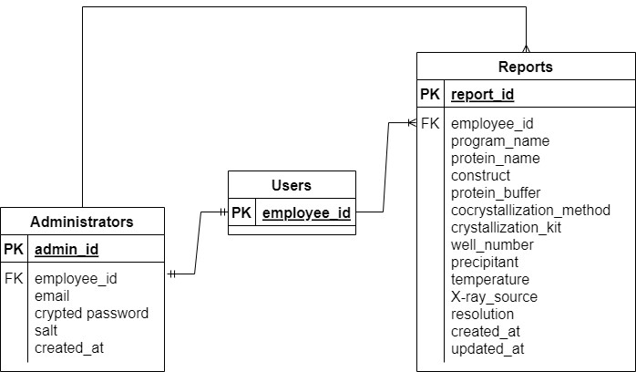

# csv_maker

## サービス概要
本アプリ経由でレポートを出力することで、タンパク質の結晶化に成功した試薬をcsvファイルとして取得できます。  
そのため、出力されたcsvファイルを用いて、過去に成功した結晶化試薬を分析できます。  
本アプリを使用することで、レポート作成とは別に、Excelファイルに同じ情報を入力する手間が省けます。  

## このサービスへの思い・作りたい理由
私の以前の部署では、タンパク質の結晶化スクリーニングを実施しており、結晶化に成功した試薬を    
レポートとして、PowerPointのファイルで毎月5回程度報告しております。  
このデータを分析し、良い結果を出さない試薬をスクリーニングから除くことで、  
スクリーニングを効率化できるのではないかと考えております。  
ただし、過去のデータをcsvファイルにまとめる作業は大変ですので、今回のアプリを活用して  
レポートを作成することで、試薬情報を効率的に収集できないかと考えました。  

## ユーザー層について
弊社の以前の部署での利用を想定しております。  
ユーザーは5人以下です。  

## サービスの利用イメージ
GitHubのコードをcloneして、社内サーバーでwebアプリを立ち上げて、情報を蓄積できるようにする。  

## ユーザーの獲得について
ユーザーの獲得は想定しておりませんが、General Public Licenseのため、ご利用は自由です。  

## サービスの差別化ポイント・推しポイント
マイクロソフトのAccessで似たようなことができる可能性があるが、弊社では、Accessを導入する必要があり、  
ハードルが高い。  

## 機能候補
MVPリリース時に作っていたい機能  
・レポートの入力フォーム画面  
・レポートの出力画面  
・データベースからcsvファイルを出力する機能  
・マルチ検索・オートコンプリート機能で入力ミスを減らす。  
・キューとバックグラウンド処理機能で、ユーザーがジョブの完了を待たなくて済むようにする。  
・ログファイル読み込み(アップロード)による数値の自動入力  

本リリースまでに作っていたい機能  
・Admin機能を実装し、間違って作成したレポートのデータを削除できるようにする。  
・入力途中のデータの保存機能  
・レポートの出力画面をPDFファイルで出力できるようにする。  

## 機能の実装方針予定
・レポートの入力フォーム画面  
・レポートの出力画面  
・Admin機能を実装し、間違って作成したレポートのデータを削除できるようにする。  
　これまでのrailsのカリキュラムを参考にして、実装します。  

・データベースからcsvファイルを出力する機能  
　require 'csv'を使用します。  

・マルチ検索・オートコンプリート機能  
　下記のstimulus-autocompleteを使用して実装する。  
　https://github.com/afcapel/stimulus-autocomplete  

・キューとバックグラウンド処理機能  
　ActiveJobとSidekiqを使用して、実装する予定です。  

・ログファイル読み込み(アップロード)による数値の自動入力  
　アップロードされたログファイルをopenし、readlineとif文を組み合わせて、  
　該当する数値を取得する。  

・入力途中のデータの保存機能  
　enum status: { published: 0, draft: 1 }  
　のようにステータスを用意して、publishedのデータだけcsvに出力すれば良いと考えております。  

・レポートの出力画面をPDFファイルで出力できるようにする。  
　pdfkitなどを使用する予定です。(要調査)  

## 画面遷移図 Figmaのリンク  
https://www.figma.com/file/ZYuYwp97DP2jDBQx8hbIDR/csv_maker-(Copy)?type=whiteboard&node-id=0%3A1&t=SeaISk9wlVU5hlB4-1  

## ER図  
  